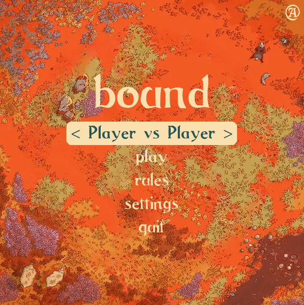

# Bound

This project is a part of the Artificial Intelligence course unit @ FEUP. 

[Bound](https://boardgamegeek.com/image/7331845/bound) is a two-player board game that we recreated in Python, including the development of AI-powered CPU players.



## Members

| Name | Email |
|-----|----|
| José Luís Cunha Rodrigues | up202008462@fe.up.pt |
| Martim Raúl da Rocha Henriques | up202004421@fe.up.pt |
| Tiago Filipe Magalhães Barbosa | up202004926@fe.up.pt |

## Steps to run

Assuming Python is installed, run the main file:

```bash
pip install -r requirements.txt
cd src
python main.py
```

## Test

There is also a script included to run the game without the display, in order to test the bots more efficiently:

```bash
cd src
python main_dev.py
```

To run the tests, do:

```bash
cd src
python -m unittest discover -s test -p '*_test.py'
```
